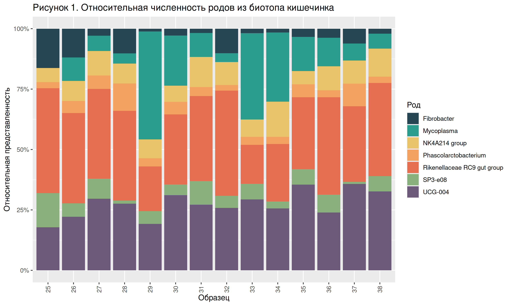
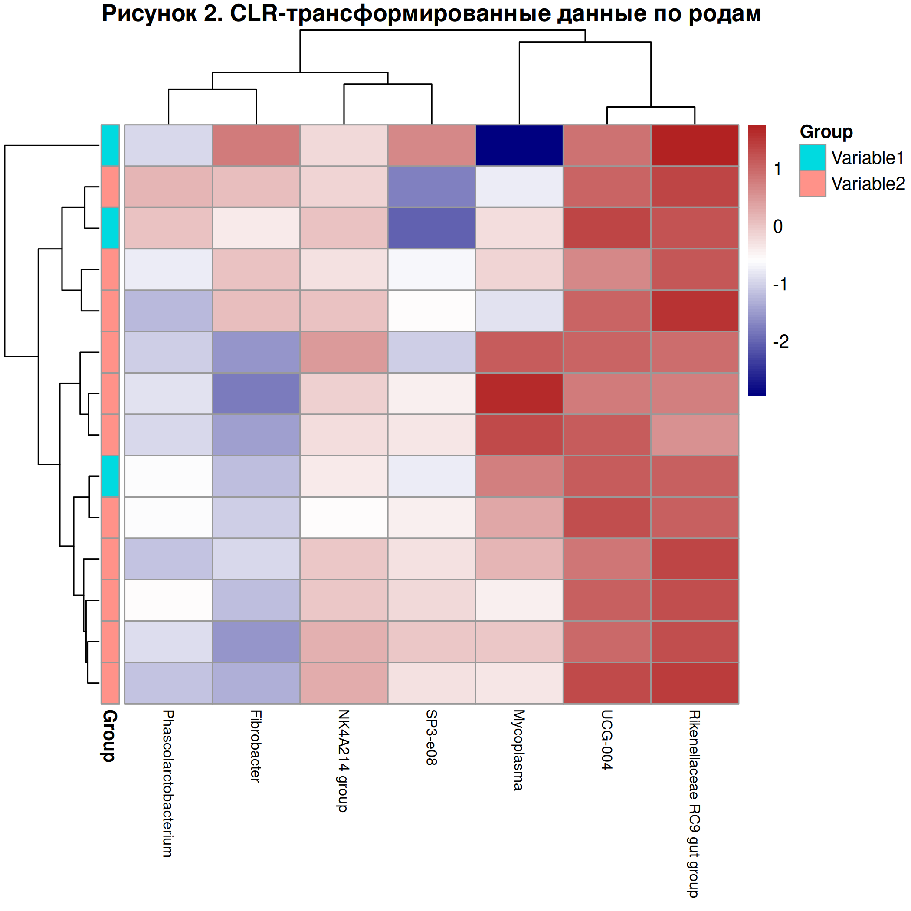
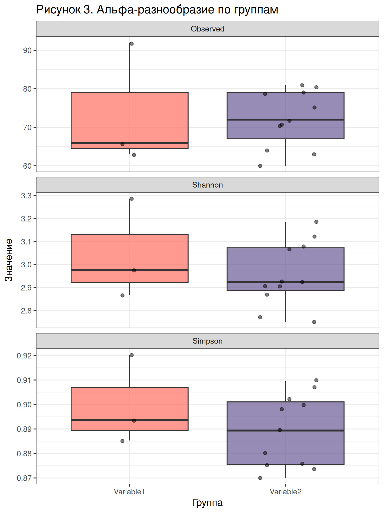

# Домашнее задание 1. Биоинформатика, 2-й год, 2-й семестр. Отчёт.

Выполнил Махлин Мирон.

## Часть 1

### Задание 1

Статистика по образцам:

| input | filtered | denoisedF | denoisedR | merged | nonchim | 
|-------|----------|-----------|-----------|--------|---------|
| 25    | 15997    | 15656     | 14984     | 15288  | 11707   |
| 26    | 14480    | 14182     | 13384     | 13816  | 10982   |
| 27    | 17476    | 17150     | 16429     | 16721  | 13042   |
| 28    | 18949    | 18561     | 17695     | 18037  | 13444   |
| 29    | 16467    | 16155     | 15428     | 15737  | 12580   |
| 30    | 17049    | 16735     | 15808     | 16306  | 12579   |
| 31    | 16948    | 16610     | 15808     | 16133  | 12326   |
| 32    | 15448    | 15140     | 14415     | 14692  | 11273   |
| 33    | 15385    | 15115     | 14302     | 14670  | 11373   |
| 34    | 16621    | 16311     | 15391     | 15785  | 12104   |
| 35    | 16629    | 16321     | 15504     | 15908  | 12608   |
| 36    | 17187    | 16919     | 16180     | 16522  | 13065   |
| 37    | 16566    | 16280     | 15417     | 15730  | 12037   |
| 38    | 17618    | 17293     | 16398     | 16835  | 12644   |

- На фильтрации отсеялось 1.9%

    Мы выбрали строгую обрезку (truncLen = 130), избавившись от участков с низким качеством на концах. Оставшиеся короткие прочтения были высокого качества и легко прошли фильтр ошибок (maxEE).

- На объединении отсеялось 18.3%

    Длина V4 региона составляет ~253 п.н. Сумма наших обрезанных прочтений 130 + 130 = 260 п.н. Теоретическое перекрытие составляло всего ~7 п.н., что очень мало. Даже с параметром minOverlap=9, часть пар прочтений не смогла надежно перекрыться и была отброшена.

- На химерах отсеялось 8%

    Стандартный уровень ПЦР-артефактов.

- Осталось 73.8%

_Техническая интерпретация_ \
Основная потеря данных произошла на этапе объединения, т.к. мы были вынуждены балансировать между качеством и длиной (overlap). Даже с overlap ниже стандартного 12, все равно было потерено довольно много данных, однако их достаточно для дальнейшей обработки, учитывая высокое качество.

_Биологическая интерпретация_ \
Мы потеряли более четверти данных, однако избавились от некачественных образцов, которые бы завышали биологическое разнообразие впоследствиии.

Прочтений на образец: 12269

ASV на образец: 501

### Задание 2

Первые 20 строк таблицы с таксономией:
| ID | Kingdom       | Phylum             | Class          | Order               | Family                     | Genus           |
|------------|---------------|--------------------|----------------|---------------------|----------------------------|-----------------|
| sp1        | Bacteria      | Verrucomicrobiota  | Kiritimatiellae| WCHB1-41            | NA                         | NA              |
| sp2        | Bacteria      | Verrucomicrobiota  | Kiritimatiellae| WCHB1-41            | NA                         | NA              |
| sp3        | Bacteria      | Verrucomicrobiota  | Kiritimatiellae| WCHB1-41            | NA                         | NA              |
| sp4        | Bacteria      | Firmicutes         | Bacilli        | Mycoplasmatales     | Mycoplasmataceae           | Mycoplasma      |
| sp5        | Bacteria      | Verrucomicrobiota  | Kiritimatiellae| WCHB1-41            | NA                         | NA              |
| sp6        | Bacteria      | Verrucomicrobiota  | Kiritimatiellae| WCHB1-41            | NA                         | NA              |
| sp7        | Bacteria      | Firmicutes         | Bacilli        | Erysipelotrichales  | Erysipelatoclostridiaceae  | UCG-004         |
| sp8        | Bacteria      | Firmicutes         | Bacilli        | Erysipelotrichales  | Erysipelatoclostridiaceae  | UCG-004         |
| sp9        | Bacteria      | Verrucomicrobiota  | Kiritimatiellae| WCHB1-41            | NA                         | NA              |
| sp10       | Bacteria      | Firmicutes         | Bacilli        | Erysipelotrichales  | Erysipelatoclostridiaceae  | UCG-004         |
| sp11       | Bacteria      | Bacteroidota       | Bacteroidia    | Bacteroidales       | Bacteroidales RF16 group   | NA              |
| sp12       | Bacteria      | Firmicutes         | Bacilli        | Mycoplasmatales     | Mycoplasmataceae           | Mycoplasma      |
| sp13       | Bacteria      | Bacteroidota       | Bacteroidia    | Bacteroidales       | Bacteroidales RF16 group   | NA              |
| sp14       | Bacteria      | Verrucomicrobiota  | Kiritimatiellae| WCHB1-41            | NA                         | NA              |
| sp15       | Bacteria      | Firmicutes         | Bacilli        | Erysipelotrichales  | Erysipelatoclostridiaceae  | UCG-004         |
| sp16       | Bacteria      | Bacteroidota       | Bacteroidia    | Bacteroidales       | Paludibacteraceae          | NA              |
| sp17       | Bacteria      | Firmicutes         | Bacilli        | Erysipelotrichales  | Erysipelatoclostridiaceae  | UCG-004         |
| sp18       | Bacteria      | Verrucomicrobiota  | Kiritimatiellae| WCHB1-41            | NA                         | NA              |
| sp19       | Bacteria      | Bacteroidota       | Bacteroidia    | Bacteroidales       | Bacteroidales RF16 group   | NA              |
| sp20       | Bacteria      | Verrucomicrobiota  | Kiritimatiellae| WCHB1-41            | NA                         | NA              |


Неклассифицированных последовательностей: 1527 (57.2%)

Показатель достаточно большой, однако у этого есть две возможных причины:
- неполнота базы данных: возможно, в образцах содержатся редкие роды, которых нет в Silva
- слишком распространённые фрагменты: некоторые участки гена, наоборот, могут встречаться в нескольких близкородственных бактериях, и отличить их невозможно

### Задание 3

Если погуглить часто встречающиеся в столбце Genus виды (UCG-004, Mycoplasma, Rikenellaceae RC9 gut group и другие), можно увидить, что все они относятся к **микробиоте кишечника**.

### Задание 4

Полученный RDS выглядит следующим образом (сохранён в файл `bee_dat_raw.RDS`):
```
phyloseq-class experiment-level object
otu_table()   OTU Table:         [ 2668 taxa and 14 samples ]
sample_data() Sample Data:       [ 14 samples by 2 sample variables ]
tax_table()   Taxonomy Table:    [ 2668 taxa by 6 taxonomic ranks ]
```

## Часть 2

### Задание 1

До фильтрации:

```
phyloseq-class experiment-level object
otu_table()   OTU Table:         [ 154 taxa and 14 samples ]
sample_data() Sample Data:       [ 14 samples by 2 sample variables ]
tax_table()   Taxonomy Table:    [ 154 taxa by 6 taxonomic ranks ]
```

После фильтрации:
```
phyloseq-class experiment-level object
otu_table()   OTU Table:         [ 7 taxa and 14 samples ]
sample_data() Sample Data:       [ 14 samples by 2 sample variables ]
tax_table()   Taxonomy Table:    [ 7 taxa by 6 taxonomic ranks ]
```

Из 154 родов остаётся лишь 7.

### Задание 2



Видим, что самые распространнёные бактерии во всех образцах --- Rikenellaceae RC9 gut group и UCG-004, самые редкие --- SP3-e08 и Fibrobacter.



Видим, что наиболее встречаемые роды  сгруппированы хорошо, а вот остальные довольно разрознены. Это значит, что по Variable 2 данные сгруппировались лучше.

### Задание 3


